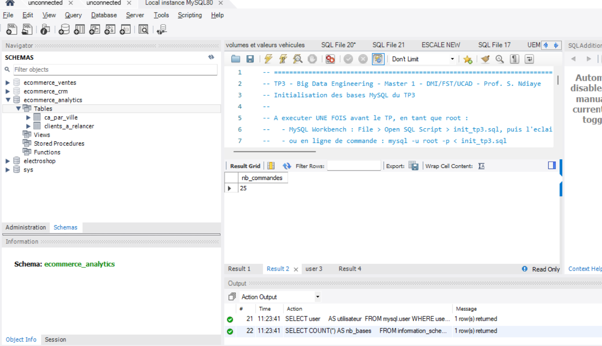

## TP3 — PySpark et MySQL : fédération de sources

### Tableau de relevés

| Mesure                        | Valeur       |
|--------------------------------|--------------|
| nb_clients (base CRM)          | 12           |
| nb_commandes (base ventes)     | 25           |
| ca_livre_total_fcfa            | 969 000 FCFA |
| ville_top_ca                   | Dakar        |
| nb_commandes_orphelines        | 1            |
| nb_clients_sans_commande       | 2            |
| categorie_top_ca               | Electronique |

### Analyse métier

Le chiffre d'affaires livré est fortement concentré à Dakar (494 000 FCFA,
soit environ 51 % du CA total livré), reflétant la densité commerciale et
démographique de la capitale sénégalaise par rapport aux autres villes.

Le mobile money (Orange Money + Wave) domine largement les paiements en
valeur, représentant jusqu'à 65,8 % du CA en Électronique et 55,1 % en
Mode, confirmant son rôle central dans les habitudes de paiement du
e-commerce sénégalais.

### Preuve Workbench

